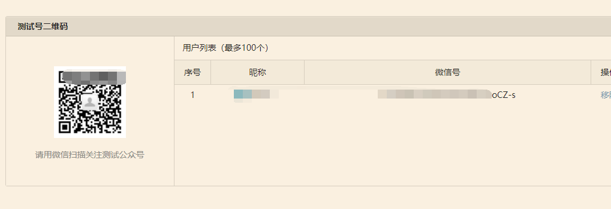
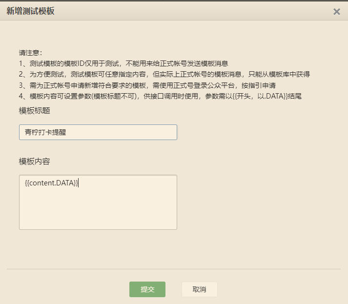
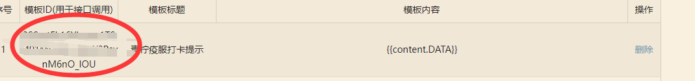

<h1 align="center">
    <br>QNYFCheckV2</br>
</h1>

## Introduce

V2是在重新梳理 `qnyf打卡` 完整流程后,摒弃了之前使用 `Selenium` 模拟浏览器行为的一个全新版本.

它将采用发包的形式来提交信息,使得提交的信息能够随心所欲.由于最新在学习 `Golang`,于是就用 `Golang` 进行了重构

## Advantages

1. 采用发包的形式, 发包的内容不再受限制,这就意味着你可以自定义提交你想要的信息
2. 由于不需要再加载 `Chromnium` 等额外插件,在运行速度上,相较于 `v1` 版本有较大的提神
3. 修改配置信息变得格外容易.详细请看[Preuse](#preuse)

## Preuse

### 地点

考虑到大多是使用者都是在学校,如果需要修改更改地点,可以更改 `config.go` 中的 `A3`.如果是外校,还需要更改院校代码,由于没尝试过其他学校的登录流程,所以暂不考虑通用性.

### 微信公众号API相关设置

为了实现微信公众号推送功能,你需要通过以下步骤来完善 `config.go` 中的一些信息.

1. 前往[微信工众平台](https://mp.weixin.qq.com/debug/cgi-bin/sandbox?t=sandbox/login)去申请一个测试账号.扫码登录即可
2. 登录之后，您将能获取到 `APPID` 和 `APPSECRET` 两个参数
3. 扫码关注测试公众号，您将能获取到 `WECHATID` 参数

4. 点击添加模板,标题可以自定义, 内容中请包涵 `{{content.DATA}}`,点击确定后,你将获取到 `TEMPLATEID` 参数



### 图片识别

本脚本使用的验证码识别技术为 [百度AI开放平台](https://ai.baidu.com/tech/ocr) api.此平台每天能够为用户提供一定次数的验证码识别功能,但目前来说已经足够使用了.

 这部分需要师傅们自己去申请.可以参考[这篇文章](https://www.jianshu.com/p/3ad636fdab4b).完成后请填写 `config.go` 中的 `CLIENT_ID` 以及 `CLIENT_SECRET`

### Web 界面的使用

[Web界面的使用](web/README.md)

## Auto Checkin

您可以将此脚本设置成定时任务,以实现自动化定时打卡的效果.这里我以我 `Linux` 为例:

```shell
> cd QNYF-V2 & go build mian.go
> crontab -e
> 0 7 * * * cd /home/lighthouse/QNYF-V2/ && ./main
```
表示会在每天早点的 `7` 点会自动执行 `cd /home/lighthouse/QNYF-V2/main`程序

## PlantoDo

- [ ] ~~增加以 `goroutine` 的形式完成过程.~~

- [x] 增加 Web 界面,将程序面向更多的使用者. 2022/3/20

- [x] 增加微信通知，将打卡情况以微信公众号的形式返回给用户 2022/3/20

## Log

- [x] 修复了 api 验证码识别导致的资源浪费 bug. 并对 api 返回的 code 进行了一定的误差处理. 2022/3/22

- [x] 修复了接口访问太快导致的接口非法访问请求问题. 2022/3/23